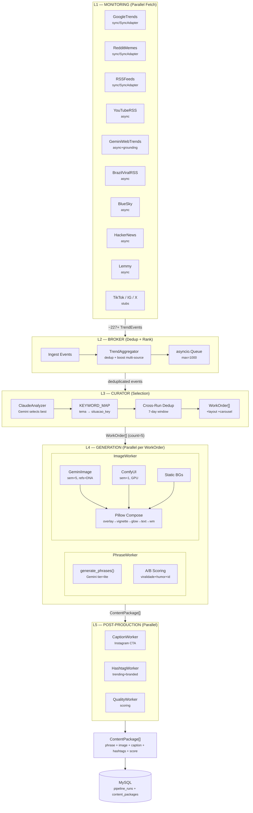
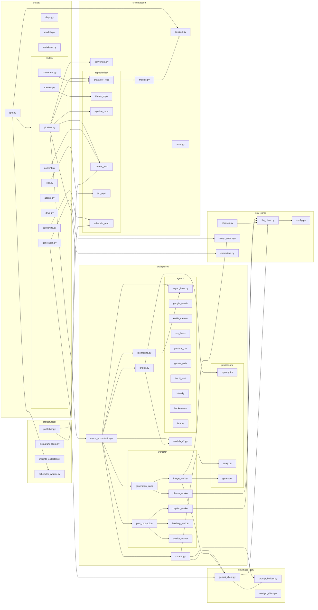
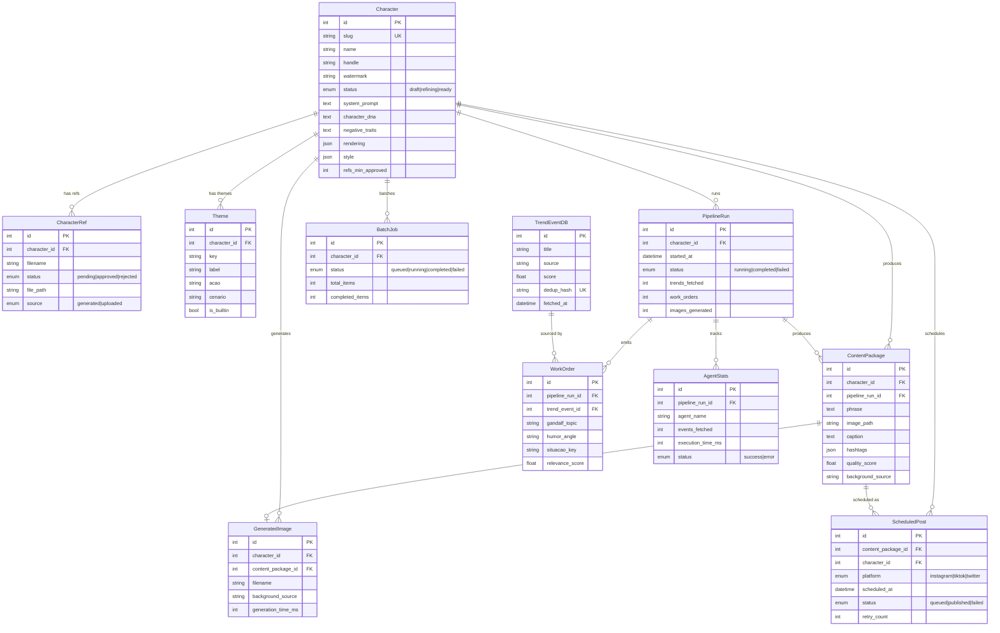
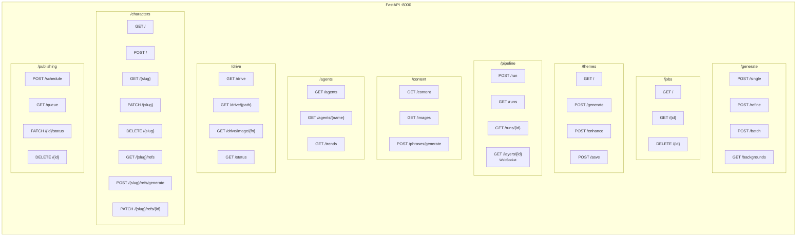
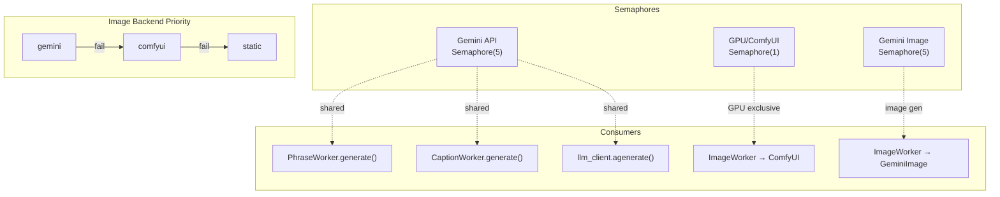
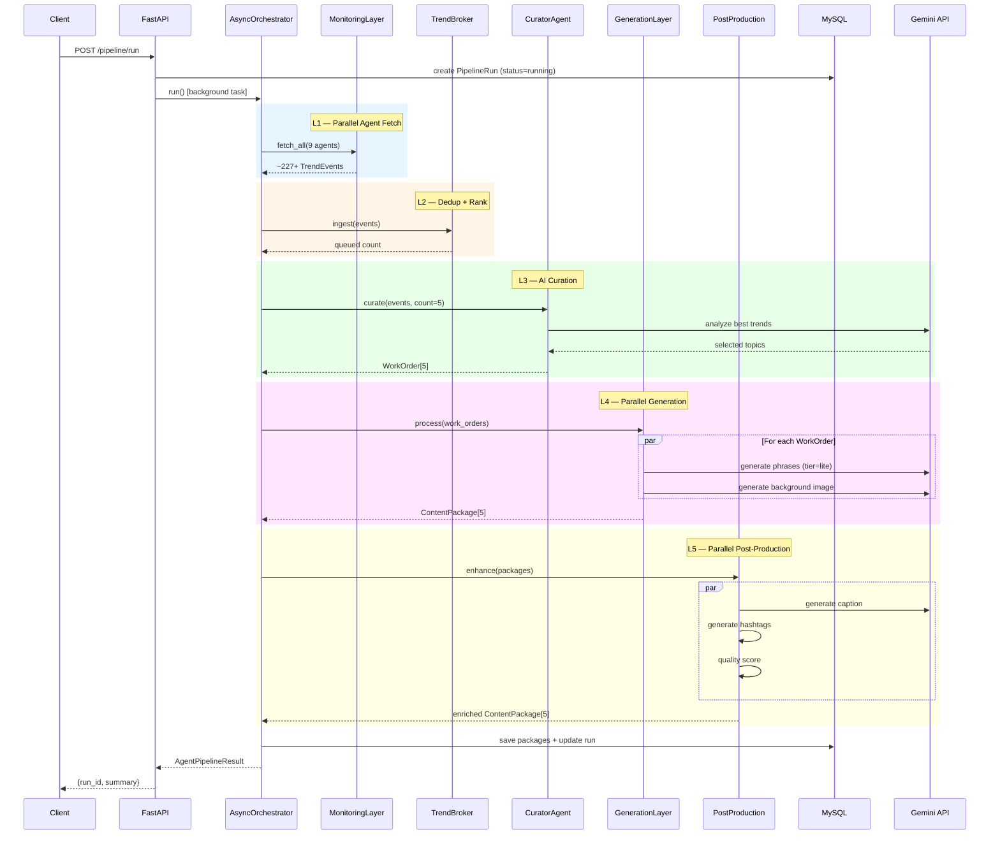

# Clip-Flow — Code Review Graph

## 1. Pipeline Architecture (5 Layers)

## 2. Module Dependency Graph

## 3. Database ER Diagram

## 4. API Route Map

## 5. Concurrency & Semaphore Map

## 6. Data Flow: Pipeline Run

