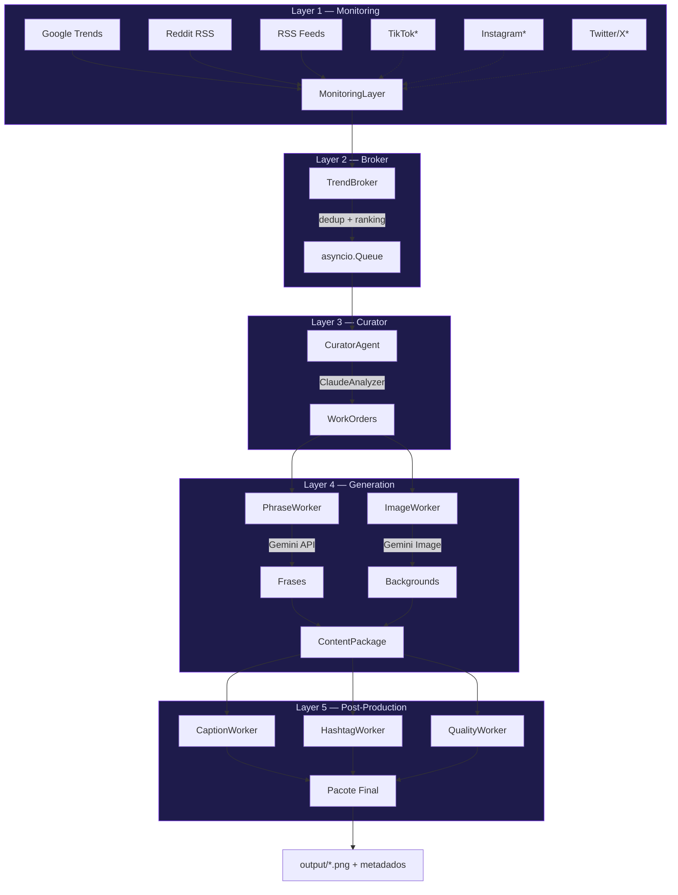

# memeLab — Plano de Implementacao

## Visao Geral
Dashboard React moderno para gerenciar o pipeline multi-agente clip-flow (memes @magomestre420).
Frontend que consome a API FastAPI existente em `localhost:8000`.

## Stack Definida
- **Next.js 15** + App Router + TypeScript
- **Tailwind CSS 4** (PostCSS plugin)
- **shadcn/ui** (Radix UI + CVA + tailwind-merge)
- **Lucide React** — icones
- **Mermaid.js** — diagramas do pipeline
- **SWR** — data fetching + cache
- **Dark mode** como padrao

## Brand / Design Tokens
- Primary: `#7C3AED` (roxo — tema mago)
- Background: dark (#09090b)
- Cards: #1c1c22
- Font: Inter
- Border radius: 12px (modern)
- Grid: 8pt spacing system

## API Backend (FastAPI — localhost:8000)
Rotas que o frontend consome:

### Pipeline
- `POST /pipeline/run` — executa em background, retorna run_id
- `POST /pipeline/run-sync` — executa e aguarda
- `GET /pipeline/status/{run_id}` — status
- `GET /pipeline/runs` — lista execucoes

### Geracao
- `POST /generate/single` — gera 1 background
- `POST /generate/refine` — refina imagem existente
- `POST /generate/compose` — background + frase = imagem final

### Frases
- `POST /phrases/generate` — { topic, count } → frases

### Temas
- `GET /themes` — lista temas
- `POST /themes` — adiciona tema
- `DELETE /themes/{key}` — remove
- `POST /themes/generate` — auto-gera via IA
- `POST /themes/enhance` — conceito simples → prompt forte

### Agentes
- `GET /agents` — lista agentes + disponibilidade
- `POST /agents/{name}/fetch` — fetch de um agente

### Drive (sub-app /drive)
- `GET /drive/images` — lista imagens (query: theme, limit, offset)
- `GET /drive/images/latest?count=N` — N mais recentes
- `GET /drive/images/{filename}` — serve PNG
- `GET /drive/themes` — temas nas imagens

### Status
- `GET /status` — health check geral

## Estrutura de Diretorios

```
memelab/
  package.json              ✅ criado
  tsconfig.json             ✅ criado
  next.config.ts            ✅ criado (proxy /api → localhost:8000)
  postcss.config.mjs        ✅ criado
  src/
    app/
      layout.tsx            — root layout (dark, Inter, sidebar)
      globals.css           — Tailwind imports + CSS vars + design tokens
      page.tsx              — Dashboard (redirect ou overview)
      dashboard/
        page.tsx            — overview: stats, status, recent activity
      agents/
        page.tsx            — agentes: lista, status, fetch, acoes custom
      pipeline/
        page.tsx            — diagrama Mermaid L1→L5, run pipeline, status
      gallery/
        page.tsx            — browse backgrounds, compose text overlay
      phrases/
        page.tsx            — gerar frases por tema
      trends/
        page.tsx            — trending topics live de todas fontes
    components/
      ui/
        button.tsx          — shadcn Button
        card.tsx            — shadcn Card
        input.tsx           — shadcn Input
        badge.tsx           — shadcn Badge
        tabs.tsx            — shadcn Tabs
        dialog.tsx          — shadcn Dialog
        select.tsx          — shadcn Select
        separator.tsx       — shadcn Separator
        scroll-area.tsx     — shadcn ScrollArea
        textarea.tsx        — shadcn Textarea
        skeleton.tsx        — loading skeleton
      layout/
        sidebar.tsx         — navegacao lateral com icones
        header.tsx          — header com titulo da pagina + acoes
        shell.tsx           — wrapper sidebar + header + content
      panels/
        stats-card.tsx      — card de estatistica com icone
        agent-card.tsx      — card de agente (nome, status, acoes)
        image-card.tsx      — card de imagem com preview
        trend-card.tsx      — card de trending topic
        phrase-list.tsx     — lista de frases geradas
        compose-dialog.tsx  — dialog para compor texto sobre imagem
        pipeline-diagram.tsx — wrapper Mermaid do pipeline
        run-pipeline-form.tsx — form para executar pipeline
    lib/
      utils.ts              — cn() helper (clsx + tailwind-merge)
      api.ts                — fetch wrapper para API clip-flow
      constants.ts          — nomes de rotas, labels, cores
    hooks/
      use-api.ts            — SWR hooks: useAgents, useStatus, useImages, etc.
      use-pipeline.ts       — hook para executar e monitorar pipeline
  public/
    favicon.ico
```

## Paginas — Detalhamento

### 1. Dashboard (`/dashboard`)
- 4 stats cards: imagens geradas, agentes ativos, pipeline runs, trends coletados
- Status do servico (GET /status)
- Ultimas 4 imagens geradas (GET /drive/images/latest?count=4)
- Botao rapido "Executar Pipeline"

### 2. Agents (`/agents`)
- Grid de cards com todos agentes (GET /agents)
- Cada card mostra: nome, tipo (source/worker), status (available/offline)
- Botao "Fetch" para agentes source (POST /agents/{name}/fetch)
- Resultado do fetch em dialog/drawer com os trends coletados
- Input custom para configurar parametros (subreddits, geo, etc.)

### 3. Pipeline (`/pipeline`)
- Diagrama Mermaid mostrando L1→L2→L3→L4→L5 com subcomponentes
- Form para executar pipeline (count, use_gemini_image, use_phrase_context)
- Lista de runs anteriores (GET /pipeline/runs)
- Status de run ativo com polling (GET /pipeline/status/{id})

### 4. Gallery (`/gallery`)
- Grid de imagens geradas (GET /drive/images com paginacao)
- Filtro por tema (GET /drive/themes)
- Click na imagem abre dialog com preview grande
- Composer: input de texto + select situacao + botao "Gerar"
  → POST /generate/compose { phrase, situacao, use_phrase_context }
- Preview da imagem composta

### 5. Phrases (`/phrases`)
- Input de tema + slider de quantidade (1-20)
- Botao "Gerar Frases" → POST /phrases/generate
- Lista de frases geradas com botao copiar
- Botao "Compor Imagem" ao lado de cada frase → abre Gallery/Composer

### 6. Trends (`/trends`)
- Tabs: Google Trends | Reddit | RSS | Todos
- Fetch por agente (POST /agents/{name}/fetch)
- Cards com: titulo, source, score, url
- Auto-refresh a cada 5 minutos
- Botao "Gerar Conteudo" por trend → redireciona para Phrases

## Diagrama Mermaid do Pipeline



## Proximos Passos (ordem de execucao)

1. `npm install` no diretorio memelab/
2. Criar `src/app/globals.css` com design tokens
3. Criar `src/lib/utils.ts` (cn helper)
4. Criar `src/lib/api.ts` (fetch wrapper)
5. Criar componentes UI base (button, card, input, badge, tabs, etc.)
6. Criar layout shell (sidebar + header)
7. Criar `src/app/layout.tsx`
8. Criar `src/hooks/use-api.ts`
9. Implementar cada pagina na ordem: dashboard → agents → pipeline → gallery → phrases → trends
10. Build e teste

## Notas
- Next.js config faz proxy de `/api/*` para `localhost:8000/*` (evita CORS)
- Dark mode via class strategy no html
- Todas chamadas API usam o proxy `/api/` do Next.js
- Mermaid renderiza client-side (dynamic import com ssr: false)
- Imagens servidas via `/api/drive/images/{filename}`
